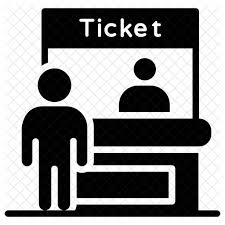
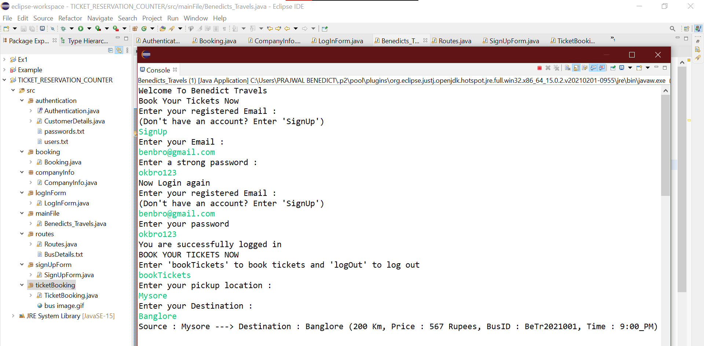
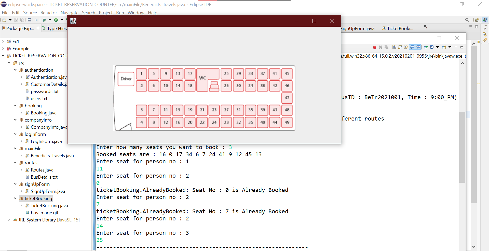
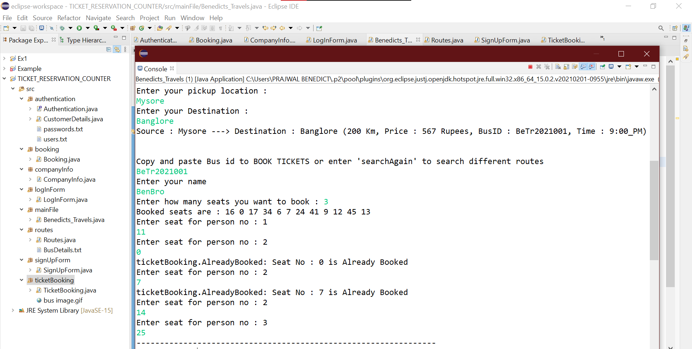
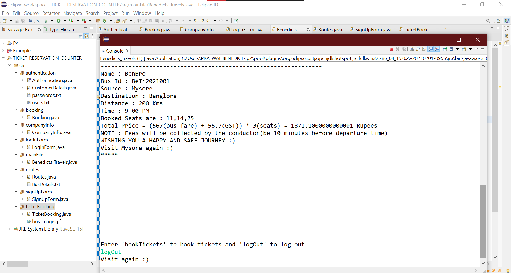

# TICKET_RESERVATION_COUNTER

| Sanitized Bus | Mandatory masks | Thermal Screening |
| :------------ |:---------------:| -----:|

## OOPJ FINAL PROJECT
 

## Introduction
 **BUS TICKET RESERVATION COUNTER**
  An application which shows the bus avaliable for the required pick location and destination selected by the user and reserves the seats for the customers.
 ## Execution Process

-  Login/SignUp Securly 
-  choose BookTickets 
-  select pickUpLocation and Destination
-  select the avaliable bus by entering the right bus number/ID
-  check for avaliable seats
-  select the number of seats 
-  the occupied seats are shown before selecting your seat numbers
-  choose the empty seats from the image shown 
-  fill the required details 
-  confirm with your selected details for the reservation  
-  Print ticket
-  Continue with further booking or logout

## Screenshots 
## Example of a customer booking his ticket
 
 
 
 

other sreenshots of invalid inputs are shared in ss folder

## Developed By : PRAJWAL BENEDICT A
## IDE : Eclipse

